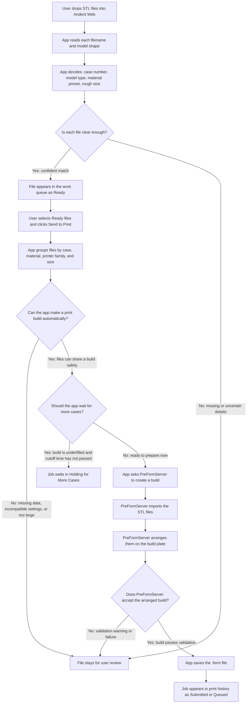
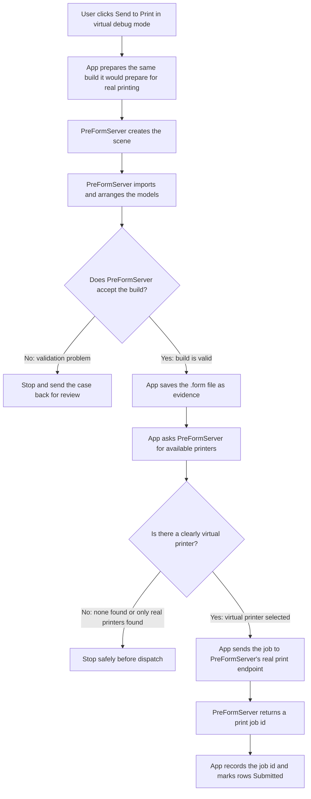

# Virtual Printer Debug Handoff

Added 2026-04-28.

This note captures the current Andent Web happy path and the proposed debug mode for exercising the real PreFormServer print endpoint against a virtual printer device. The goal is to make launch validation prove the complete handoff path without risking a physical printer dispatch.

## Operator-Facing Happy Path

This is the flow from the user's point of view. The app is trying to answer three practical questions:

- What did the user upload?
- Can these files be prepared as a print build automatically?
- If debug mode is on, can PreFormServer accept the job on a virtual printer?



## Plain-English Decision Rules

| Decision | Yes means | No means |
| --- | --- | --- |
| Is each file clear enough? | The app found a case number, recognized the model type, chose a preset, and has enough confidence to proceed. | The filename or model is ambiguous, the case number is missing, the model type is unknown, or the app needs a person to confirm the row. |
| Can the app make a print build automatically? | The selected Ready files have stored STL paths, dimensions, case numbers, compatible presets, compatible printer family, and the estimated footprint fits the build plate. | One or more files are missing dimensions or file paths, presets conflict, printer families conflict, the case is too large, or the app cannot form a safe build group. |
| Should the app wait for more cases? | The build is valid but still below the configured density target, and the daily cutoff time has not passed. Holding lets the app combine it with more compatible cases later. | The build is full enough, holding is disabled, or the cutoff time has passed, so the app should prepare it now. |
| Does PreFormServer accept the arranged build? | PreFormServer can create the scene, import the models, arrange them, and validation reports no blocking errors. | PreFormServer reports a validation problem, such as a support or geometry issue, so the case should return to user review instead of being submitted blindly. |
| Is a virtual printer available? | PreFormServer lists a device that the app can safely identify as virtual, so debug mode may use the real print endpoint without touching a physical printer. | No virtual device is available, or the only available devices look physical, so debug mode must stop safely. |

## Current Connection Status

| Building block | Current connection | Code reference |
| --- | --- | --- |
| Upload intake | Connected through the FastAPI upload route | `app/routers/uploads.py:35` |
| Classification | Connected through parallel saved-file classification | `app/services/classification.py:351` |
| SQLite row persistence | Connected through upload session persistence | `app/database.py:629` |
| Build arrangement | Connected through `send_ready_rows_to_print` and `plan_build_manifests` | `app/services/print_queue_service.py:640`, `app/services/build_planning.py:276` |
| PreForm scene preparation | Connected through scene creation, model import, auto-layout, validation, and `.form` save | `app/services/print_queue_service.py:328` |
| Real print endpoint | Connected only when `ANDENT_WEB_PRINT_DISPATCH_MODE` is `virtual` or `real`; default mode remains `.form` save-only | `app/services/print_queue_service.py:246`, `app/services/preform_client.py:224` |
| Virtual-printer simulation | Exists in the older core service pipeline, not in the FastAPI web handoff | `core/andent_service_pipeline.py:1112` |

The default FastAPI web path is therefore still a prepare-and-queue path. It creates a PreForm scene, imports STL files, auto-layouts, validates, saves a `.form`, then records a local `print_jobs` row with `print_job_id = None`. Virtual debug mode now opts into calling PreFormServer's real print endpoint after the `.form` save and validation pass.

## Proposed Dispatch Modes

The handoff uses this explicit setting:

```text
ANDENT_WEB_PRINT_DISPATCH_MODE=save_form
ANDENT_WEB_PRINT_DISPATCH_MODE=virtual
ANDENT_WEB_PRINT_DISPATCH_MODE=real
```

| Mode | Purpose | Behavior |
| --- | --- | --- |
| `save_form` | Default local-safe mode | Preserve current behavior: save `.form`, create local print job row, do not call PreFormServer print endpoint. |
| `virtual` | Thorough debug and release-gate mode | Resolve a virtual PreForm device and call `PreFormClient.send_to_printer(scene_id, device_id, job_name)`. Refuse to dispatch if no clearly virtual device is available. |
| `real` | Explicit production dispatch | Call the same real print endpoint for a physical printer only when separately enabled and operator-approved. |

Default should remain `save_form` so development and customer demos cannot accidentally dispatch. Release validation should set `ANDENT_WEB_PRINT_DISPATCH_MODE=virtual`.

The main page also exposes a temporary **Virtual printer debug** toggle in the PreFormServer Setup Center. That toggle updates the current running FastAPI process only through `/api/preform-setup/dispatch-mode`; restarting the server resets the mode back to the environment/default value. The in-app toggle intentionally supports only `save_form` and `virtual`, not `real`.

## Virtual Mode Safety Contract

Virtual mode should be fail-closed:

1. List devices from PreFormServer.
2. Select only a device that is clearly virtual according to PreFormServer metadata or a conservative name/id allowlist.
3. Refuse handoff if no virtual device is available.
4. Refuse handoff if the resolved device appears physical.
5. Store the returned `print_id`/`job_id` in `print_jobs.print_job_id`.
6. Store enough evidence in the local print job row to prove the endpoint was reached: scene id, print id, job name, form file path, status, printer type, resin, layer height, validation result, and case ids.

This is more thorough than app-side queue simulation because it exercises the actual PreFormServer final handoff endpoint while keeping physical printers out of scope.

## Expected Virtual Mode Flow



## Verification Targets

Virtual mode should add or update tests for:

| Test area | Expected proof |
| --- | --- |
| Unit: dispatch mode parsing | `save_form` is default; invalid values fail clearly. |
| Unit: virtual device guard | Physical devices are rejected in `virtual` mode. |
| Unit: PreForm handoff | `send_to_printer` is called only in `virtual` or `real` modes. |
| Integration: happy path | Upload/select/send creates a `print_jobs` row with non-empty `scene_id`, `form_file_path`, and `print_job_id`. |
| Release gate: live PreForm | Browser flow proves a virtual PreForm print job was accepted by the real endpoint. |

Focused implementation verification on 2026-04-28:

```text
PYTEST_DISABLE_PLUGIN_AUTOLOAD=1 python -m pytest tests -q
283 passed, 5 warnings

npx tsc --noEmit
passed
```

## Implementation Notes

- Current save-only behavior remains the default.
- `Settings` in `app/config.py` exposes `print_dispatch_mode`.
- The PreForm setup router exposes `GET/PATCH /api/preform-setup/dispatch-mode` for the temporary in-app toggle.
- Keep device-selection logic inside the print queue or PreForm handoff layer, not the browser.
- Virtual mode uses `PreFormClient.list_devices()` before dispatch.
- Virtual and real modes use the existing `PreFormClient.send_to_printer()` method for the endpoint call.
- `tests/test_preform_handoff.py` covers virtual dispatch, physical-only refusal, and invalid mode rejection.
- Keep the older `core/andent_service_pipeline.py` virtual-printer behavior as reference only; do not route the web app through the desktop pipeline.
