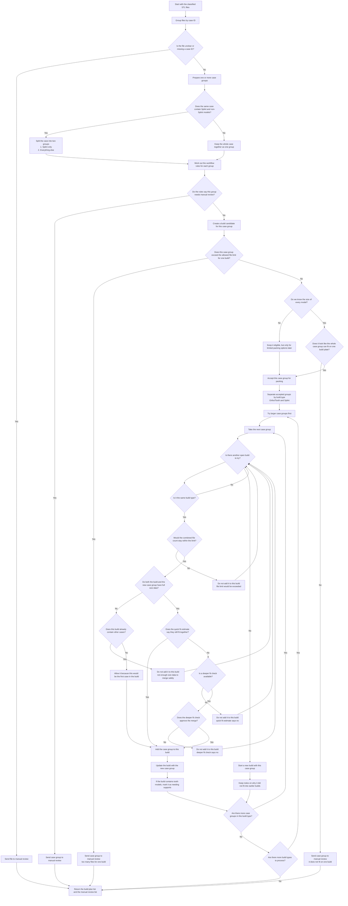

# Andent V2 Model Packing Flowchart

This flowchart shows how the system currently decides:
- which models can go into the same build
- when a case must be sent to manual review
- when a case joins an existing build or starts a new one

Primary source:
- `andent_planning.py` (`plan_andent_builds`)

## Current behavior summary
- The planner works at the case-group level, not one model at a time.
- A mixed same-case `Splint + Ortho/Tooth` input is split into two groups before packing.
- All other compatible files from the same case stay together.
- If a whole case group cannot fit on one build, it goes to manual review instead of being split further.
- The planner uses a simple first-fit approach within each build type:
  - try larger case groups first
  - try existing builds one by one
  - if none work, start a new build
- `max_batch_size` is currently `10` files per build, not `10` cases.
- Missing model dimensions are only tolerated for a brand-new build; they block merging into a build that already has content.

## What determines "how many / what models go into a build" currently
- Workflow-family compatibility:
  - `Splint` never shares a build with `Ortho/Tooth`
  - `Ortho` and `Tooth` may share a build
- Hard file-count cap:
  - total files on a build cannot exceed `10`
- Build-plate fit heuristic:
  - combined model dimensions must pass the packing estimate
- Safe-merge rule for unknown dimensions:
  - unknown dimensions cannot be merged into an already non-empty build
- Case cohesion:
  - the planner packs whole case candidates, not partial cases

## What "packing heuristic" means
- A packing heuristic is a quick best-effort fit estimate.
- In this planner, it means the system uses model dimensions to estimate whether a set of models should fit on the build plate before doing any real scene creation.
- It is faster than a full placement simulation, but it is still an estimate, not a guarantee.
