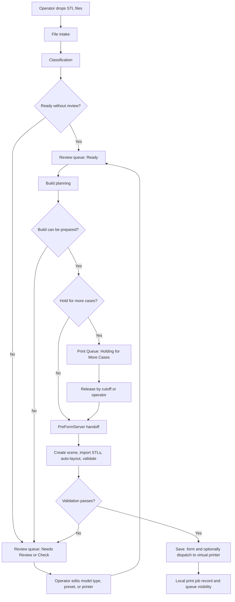
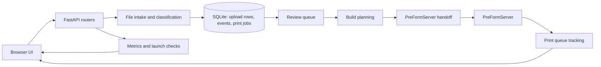

# Andent Web PRD

> **Status:** Phase 1 repository implementation complete. Pre-release validation failed (2026-04-28) — 9/9 gates blocked: TypeScript compile errors, browser smoke test failures, live PreForm handoff timeout, launch validation timeout. See `docs/02_planning/98_VerificationArtifacts/pre_release_20260428/verdict.md` for full evidence.

## Metadata

- Profile: `standard`
- Rounds: `6`
- Final ambiguity: `14.7%`
- Threshold: `20%`
- Context type: `brownfield`
- Context snapshot: `docs/00_context/context-andent-web-auto-prep-20260415.md`
- Transcript: `docs/00_context/interview-andent-web-auto-prep-20260415.md`

## Clarity breakdown

| Dimension | Score |
| --- | --- |
| Intent | 0.87 |
| Outcome | 0.80 |
| Scope | 0.88 |
| Constraints | 0.84 |
| Success | 0.90 |
| Context | 0.84 |

## Intent

Eliminate manual preparation of print jobs.

## Desired Outcome

A web-based application that accepts dropped case files, uploads them, classifies model type and preset, confirms or derives case identity automatically, prepares classification metadata, and **hands off to PreFormServer** for downstream processing (orient, pack, supports, dispatch, tracking).

## Product Building Blocks

Andent Web should be understood as an intake-to-handoff system. It owns the browser intake workflow, classification metadata, review queue, build grouping, and PreFormServer handoff. PreFormServer remains responsible for orienting, packing, support generation, printer dispatch, and downstream print tracking.

### End-to-End Flow



### Block Map



### Readiness Review Tracker

This table is the working checklist for reviewing one block at a time. Update the verdict only after checking the code path, tests, and current validation evidence for that block.

| Block | Purpose | Primary code/docs | Readiness verdict | Review notes |
| --- | --- | --- | --- | --- |
| Browser UI | Operator workflow for upload, review, edits, send-to-print, and print queue visibility | `app/static/app.js`, `app/static/index.html`, `app/static/styles.css` | Ready | `npx tsc --noEmit`, `test_frontend_static.py`, Chromium smoke, and serial release-gate suite pass locally. Run Playwright release gates serially because fixed live-app ports collide under parallel workers. |
| FastAPI app shell | Server startup, static pages, router wiring, health endpoints | `app/main.py` | Ready | `test_health_endpoints.py`, `test_network_binding.py`, app-factory route smoke, static page smoke, and real `ANDENT_WEB_HOST`/`ANDENT_WEB_PORT` override check pass locally; existing network-binding test is conceptual and should be tightened later. |
| File intake and classification | Save STL uploads, detect duplicates, classify model type, assign presets, enrich dimensions/thumbnails/volume | `app/routers/uploads.py`, `app/services/classification.py`, `core/andent_classification.py` | Ready | Upload/classification, parallel error handling, live validation, launch helper, and release-gate verifier tests pass locally. Isolated fixture check gives 100% Ready for ortho/splint/tooth happy folders and 2/2 Needs Review for ambiguous guard. Caveat: default `validate_launch.py` fixture sweep mixes guard/output folders into aggregate metrics and should be scoped before using it as a release verdict. |
| Review queue and persistence | Store upload rows, status transitions, events, edits, deletion rules, history separation | `app/database.py`, `app/schemas.py` | Ready | Queue/polling/undo/selection/schema tests pass locally; direct database/API smoke confirms active/history split, manual edit persistence, duplicate approval, submitted-row immutability, delete guard, and event logging. Caveat: several durable override tests are placeholder `pass` tests and should be replaced with real assertions. |
| Preset and compatibility catalog | Map UI presets to PreForm/material/printer settings and compatibility groups | `app/services/preset_catalog.py` | Ready | Preset catalog, default preset, release-gate normalization, build-planning, batching, and handoff preset/printer tests pass locally. Direct policy smoke confirms exactly 7 presets, Form 4BL/Form 4B support, Precision Model vs LT Clear compatibility split, stable PreForm hints, and printer XY budgets. Caveats: Form 4B density/full-arch factor is not separately calibrated yet, and dense-build spacing may need live tuning because the policy uses `model_spacing_mm = 1` while earlier dense calibration used zero spacing. |
| Build planning | Preserve cases, group compatible rows, estimate build density, identify non-plannable cases | `app/services/build_planning.py`, `app/services/planning_preview.py` | Ready | Build planning, batching, planning-preview, and integration tests pass locally; direct smoke confirms compatible case grouping, preset import groups, density estimate, non-plannable incompatible cases, missing file paths, and preview `cannot_fit` reporting. Caveats: build fit is still heuristic from XY bounding boxes/full-arch factor rather than live fit; unknown preset rows are skipped instead of surfaced as explicit non-plannable cases; hold/release policy is applied later in `print_queue_service.py`, not in the planner itself. |
| PreFormServer setup and handoff | Install/start/check PreFormServer, create scenes, import files, auto-layout, validate, save .form, optional virtual dispatch | `app/routers/preform_setup.py`, `app/services/preform_setup_service.py`, `app/services/preform_client.py`, `app/services/print_queue_service.py` | Ready | PreForm setup, handoff, integration, and error-handling tests pass; local PreFormServer root/devices probes return 200; serial Chromium release gate confirms browser-to-app-to-live-PreForm handoff. Caveats: release proof covers save-form/virtual flow, not physical printer dispatch; setup is local managed ZIP/install or explicit local API URL, not remote download; live gates depend on localhost PreFormServer health/version; UI intentionally rejects real-printer dispatch mode. |
| Print queue tracking | Track local print jobs, held builds, releases, screenshots/previews, status sync | `app/routers/print_queue.py`, `app/services/print_queue_service.py`, `app/services/formlabs_web_client.py` | Provisionally ready | Print queue schema/CRUD, polling, Formlabs client, screenshot, held-build, operator release, cutoff release, and virtual dispatch tests pass; direct smoke confirms `/api/print-queue/jobs`, Formlabs status sync, screenshot caching, and generated preview PNG fallback. Caveats: Formlabs Web API sync is mocked locally unless a real token/environment is available; save-form-only jobs have no external print ID to poll; generated previews are schematic, not actual PreForm/Printer imagery; automatic cutoff release is process-local because only held jobs created in the current server process are auto-released after cutoff, so restart recovery needs a durable sweep. |
| Metrics and validation | Record workflow outcomes and expose launch-readiness checks | `app/routers/metrics.py`, `app/services/metrics.py`, `scripts/validate_launch.py` | Provisionally ready | Metrics service, metrics wiring, validate-launch helpers, and release-gate verifier tests pass; scoped launch validation against `01_ortho_happy` on live app/PreFormServer passes with 100% straight-through, 0% review, 0.3s p95 latency, and 100% dispatch success; `/api/metrics/launch-check` returns `overall_pass=true`. Caveats: metrics are process-memory only and reset on server restart; launch targets are hardcoded in `MetricsService.check_launch_targets` instead of reading runtime settings; scoped validation can pass on too-small fixture sets, so production sign-off still needs a representative batch and saved artifacts; broad default fixture sweep includes guard/output folders and gives misleading aggregate failures; dispatch success records send-to-print request outcome, not downstream physical print completion. |

## In Scope

- Browser-based file drop intake for case files.
- Upload pipeline for incoming files.
- Automatic model type detection.
- Automatic preset assignment based on model type, with operator override support.
- Automatic case ID confirmation / derivation on the happy path.
- Human review flow only for defined outliers.
- **Handoff to PreFormServer** for downstream processing.

> **PreFormServer handles:** orient/pack, support generation, job queue management, printer dispatch, print status tracking.

Phase-1 `Model Type` values:
- `Ortho - Solid`
- `Ortho - Hollow`
- `Die`
- `Tooth`
- `Splint`

## Out-of-Scope / Non-goals

- Manual support tweaking tools in phase 1.
- Printer-fleet optimization in phase 1.
- Job queue management (handled by PreFormServer).
- Printer dispatch (handled by PreFormServer).
- Print status tracking (handled by PreFormServer).
- Orient & pack (handled by PreFormServer).
- Support generation (handled by PreFormServer).

> **Architecture clarification (2026-04-18):** PreFormServer API handles all print-related operations. Andent Web's scope is limited to intake, classification, review, and handoff to PreFormServer.

## Decision Boundaries

The system may proceed without human confirmation when:

- model type detection is confident
- case ID is confidently determined

The system must stop and route to human review when:

- model type detection is low confidence
- case ID is ambiguous or missing

The system should not require human review for standard die/tooth support generation or standard printer-group dispatch merely because those steps were previously blocked in the MVP.

## Constraints

- Human review should be limited to outliers and should not exceed `2%` of cases.
- Prior MVP-era safeguards blocking tooth-model auto-prep and printer auto-dispatch should be removed for standard cases in this PRD.
- This is a phase-1 PRD for a web product, not a desktop-only extension.

## Testable Acceptance Criteria

- The system achieves `>=95%` straight-through processing at launch.
- Standard cases complete the following **within Andent Web** without operator touch:
  - model type detection
  - preset assignment
  - case ID confirmation
- Human review is reserved only for:
  - low-confidence model type matches
  - ambiguous or missing case IDs
- Human-reviewed outliers remain at or below `2%` of total cases.
- Standard die/tooth cases are not blocked by the previous MVP-era tooth support safety gate.
- **Andent Web sends prepared jobs to PreFormServer** (PreFormServer handles orient/pack/support/dispatch).

> **Note:** PreFormServer handles orient/pack, support generation, job queue management, printer dispatch, and print status tracking. Andent Web's acceptance criteria focus on intake-to-handoff accuracy.

## Approved Phase 0 Scope

Phase 0 delivered classification intake (FastAPI server, STL upload, classification table, editable Model Type/Preset). **Complete as of 2026-04-18.** See `docs/99_Archive/phase-0-build-today.md` for full detail.

## Assumptions Exposed And Resolutions

- Assumption: current brownfield safeguards around tooth auto-prep and dispatch might still be required.
  - Resolution: explicitly rejected for standard cases.
- Assumption: multiple operational exceptions might need human review.
  - Resolution: outlier handling is intentionally narrow and limited to low-confidence classification and ambiguous/missing case IDs.

## Pressure-pass Findings

- Pressure pass revisited the existing repository safety model rather than accepting it as a product requirement.
- Clarified requirement: remove current Andent MVP restrictions on tooth auto-prep and printer auto-dispatch for standard cases.

## Brownfield Evidence Vs Inference

### Evidence from repository

- `andent_classification.py` contains model-type classification and case ID extraction logic.
- `api_client.py` contains auto-support and printer dispatch primitives.
- `app_gui.py` contains queue and printer-selection concepts.
- `docs/04_customer-facing/mvp-local-test-guide.md` documents that the current MVP intentionally avoids printer dispatch and tooth-model automation.

### Inference

- A web product can likely reuse or wrap parts of the current classification, planning, and dispatch logic, but exact architecture remains for planning.

## Technical Context Findings

- Relevant likely touchpoints:
  - `andent_classification.py`
  - `andent_planning.py`
  - `processing_controller.py`
  - `api_client.py`
  - `local_printer_controller.py`
  - `app_gui.py`
- Brownfield tension explicitly resolved:
  - current safety limits are implementation-era constraints, not phase-1 PRD constraints

## Condensed Transcript

1. Business outcome: eliminate manual preparation of print jobs.
2. Required automation (Andent Web scope): classification, case ID confirmation, preset assignment, and handoff to PreFormServer.
3. Allowed human-review triggers: low-confidence model type detection and ambiguous/missing case IDs.
4. Existing tooth auto-prep and dispatch safeguards: remove them for standard cases.
5. Phase-1 non-goals: manual support tweaking tools and printer-fleet optimization.
6. **PreFormServer handles:** orient/pack, support generation, job queue management, printer dispatch, print status tracking.
7. Launch success metric: `>=95%` straight-through classification accuracy.

## Recommended Handoff

Recommended next step: `$ralplan`

Suggested invocation:

```text
$plan --consensus --direct .omx/specs/deep-interview-andent-web-auto-prep-prd.md
```

Alternative handoffs:

- `$autopilot .omx/specs/deep-interview-andent-web-auto-prep-prd.md`
- `$ralph .omx/specs/deep-interview-andent-web-auto-prep-prd.md`
- `$team .omx/specs/deep-interview-andent-web-auto-prep-prd.md`

## Residual Risks

- The spec sets a clear straight-through target, but it does not yet define:
  - upload-to-queue latency target
  - printer dispatch success-rate target
  - handling rules for mixed-model-type uploads
- Those should be tightened during planning, not reopened as intent ambiguity.

### Performance Targets (2026-04-28)

The following targets were identified as missing from the original PRD and should be tracked:

| Target | Value | Notes |
|--------|-------|-------|
| Upload-to-queue latency (p95) | `<= 30s` | For 100-file batch under representative load |
| Dispatch success rate | `>= 99%` | Non-vacuous; excludes zero-job scenarios |
| Mixed-model-type handling | Per-file | Each file classified individually; mixed types allowed in batch |
