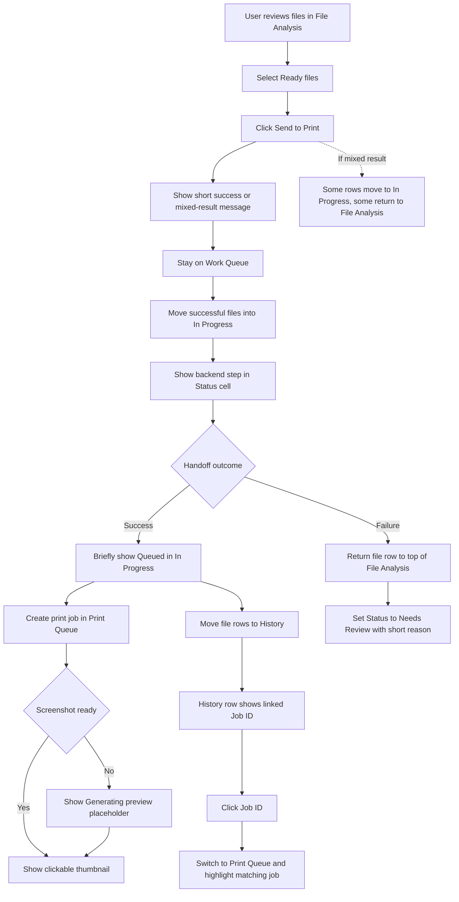
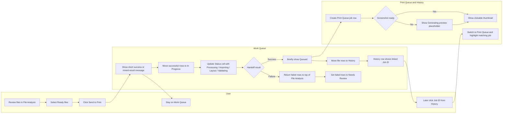
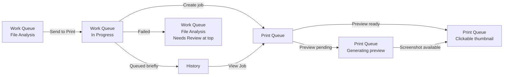

# Work Queue Print Handoff Flowchart

## Reading Guide

- `File Analysis` = needs user attention
- `In Progress` = system is handling the file, read-only
- `Print Queue` = real print jobs only
- `History` = completed file-level traceability

## Swimlane Version

## Screen-State Version

